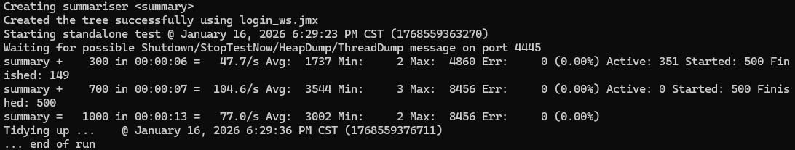

# 并发与性能测试报告——

本文档用于记录 **分布式高性能五子棋对战引擎** 的并发与性能验证过程，
重点展示系统在高并发 WebSocket 场景下的稳定性、性能边界以及工程分析结论。

---

## 1. 测试背景与动机

### 1.1 背景说明
本项目面向实时对战类应用场景，核心通信模型基于 WebSocket 长连接。
在高峰期（如大量玩家同时进入大厅或对局），服务端需要在短时间内处理
大量连接建立、鉴权与状态初始化请求。

### 1.2 测试动机
本次并发测试的主要动机包括：

- 验证 Netty Reactor 线程模型在高并发连接场景下的稳定性
- 验证 WebSocket 握手与鉴权流程是否存在阻塞或异常放大问题
- 确认系统在高并发场景下的可预测性与错误处理能力
- 为后续架构优化与容量评估提供数据依据

---

## 2. 测试目标

本次 Benchmark 不以“刷极限 TPS”为目标，而是关注以下工程指标：

- WebSocket 握手成功率
- 并发建连场景下的响应时间分布
- 高并发场景下的错误率（连接失败、异常断连等）
- 系统在压力下的稳定性与可恢复性

---

## 3. 测试环境

### 3.1 硬件与系统环境

| 项目     | 说明                                              |
| -------- | ------------------------------------------------- |
| 操作系统 | Windows 11                                        |
| CPU      | Intel Core i5-10210U（4C/8T，移动端低功耗处理器） |
| 内存     | 16GB                                              |
| 网络环境 | 本机回环（localhost）                             |

### 3.2 软件环境

| 项目       | 版本                      |
| ---------- | ------------------------- |
| JDK        | OpenJDK 21                |
| 服务端框架 | Netty (NIO)               |
| 协议       | WebSocket + Protobuf      |
| 状态管理   | Redis / Redisson          |
| 压测工具   | Apache JMeter（CLI 模式） |

> 说明：  
> 本次测试在单机环境下进行，结果主要反映系统在极端短连接并发场景下的行为，
> 并不等同于分布式或生产环境的最终性能指标。

---

## 4. 测试模型设计

### 4.1 并发模型说明

- 并发线程数： `500`
- 总请求数：`1000`
- 测试方式：瞬时并发启动（非匀速）

### 4.2 单线程执行流程

每个压测线程执行以下完整流程：

1. 通过 HTTP 接口完成用户登录，获取 JWT
2. 携带 JWT 发起 WebSocket 连接请求
3. 完成 WebSocket 握手（HTTP Upgrade）
4. 握手成功后立即断开连接（不发送业务消息）

### 4.3 模型设计说明

该测试模型用于模拟以下真实场景：

- 高峰期大量玩家同时进入游戏大厅
- 短时间内 WebSocket 握手请求集中到达
- 验证服务端在连接建立与销毁阶段的稳定性

---

## 5. 测试项说明

### 5.1 测试项一：HTTP 登录接口并发验证
- **测试目标：**

  - 验证用户登录接口在并发访问场景下的稳定性
  - 确认在高并发登录请求下，服务端无异常抛出、无资源泄漏
  - 验证登录流程在引入缓存机制后对数据库的访问压力可控

  **关注指标：**

  - 登录接口平均响应时间
  - 最大响应时间（Tail Latency）
  - 登录失败率（HTTP 非 2xx）
  - 服务端异常日志情况

### 5.2 测试项二：WebSocket 握手并发验证
- **测试目标：**

  - 验证 WebSocket 握手流程在高并发连接场景下的稳定性
  - 确认鉴权、协议升级及 Channel 初始化过程中无阻塞与异常放大
  - 验证 Netty Reactor 线程模型在瞬时建连压力下的可预测性

  **关注指标：**

  - WebSocket 握手成功率
  - 握手阶段的响应时间分布
  - 连接异常率（断连、重置等）
  - 服务端 EventLoop 与业务线程池稳定性

> **说明：**  
> 上述测试项并非通过多个独立脚本分别执行，而是通过同一条完整的用户访问路径进行验证。
> 所有测试均整合在 `benchmark/jmeter/login_ws_dis.jmx` 脚本中，
> 单线程执行流程依次包含 **HTTP 登录 → WebSocket 握手** 两个阶段，
> 并通过 JMeter 的 Sampler 与 Listener 对不同阶段的性能指标进行区分与统计。

---

## 6. 测试结果汇总

### 6.1 50 并发测试结果

---

### 6.2 500 并发测试结果

| 指标         | 数值   |
| ------------ | ------ |
| 总请求数     | 1000   |
| 平均响应时间 | 3002ms |
| 最大响应时间 | 8456ms |
| 吞吐量       | 77.0/s |
| 错误率       | 0%     |

运行结果: 

---

## 7. 性能分析与工程结论

### 7.1 结果分析

-  在高并发瞬时建连（500 并发）场景下，系统吞吐趋于稳定但响应时间显著上升，
    表现为典型的排队延迟特征，未出现异常风暴或服务不可用情况。

### 7.2 性能瓶颈判断

综合测试结果与运行时分析，当前性能瓶颈主要来源于：

- 操作系统 TCP 建连能力
- WebSocket 握手阶段的协议开销
- 单机环境下客户端与服务端资源竞争

### 7.3 工程结论

- 系统在高并发 WebSocket 场景下具备稳定运行能力
- 未出现连接泄漏、异常风暴或线程阻塞问题
- 在当前硬件与测试模型下，性能表现符合工程预期

---

## 8. 已知限制与后续计划

### 8.1 已知限制

- 当前测试基于单机环境
- 未覆盖跨机器网络延迟
- 未模拟真实长时间在线用户比例

### 8.2 后续测试计划

- 分布式环境下的多机压测
- 长连接心跳与消息吞吐测试

---

## 9. 可复现性说明

- 所有压测脚本均已提交至仓库
- 测试结果截图与汇总数据位于 `benchmark/reports/`
- 可通过 CLI 模式直接复现主要测试结论