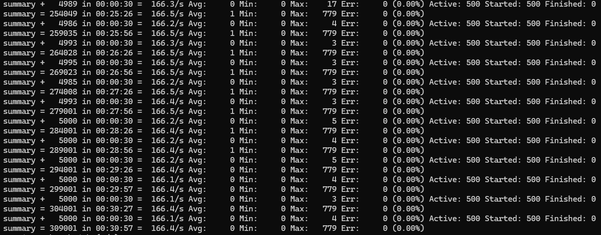
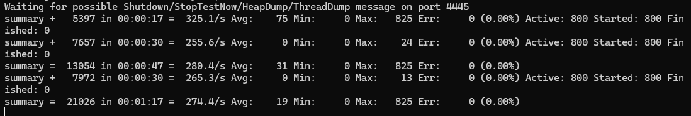

# 并发与性能测试报告 —— WebSocket 长连接稳定性验证

本文档用于记录 **分布式高性能五子棋对战引擎** 在
**WebSocket 长连接场景** 下的并发与稳定性验证过程，
重点关注系统在持续在线、周期性心跳与高并发连接数条件下的
行为表现、资源稳定性与工程可预测性。

---

## 1. 测试背景与动机

### 1.1 背景说明

在实时对战类应用中，WebSocket 长连接是核心通信方式。
与短连接不同，长连接的稳定性直接决定了系统在真实业务场景下
是否能够支持大量玩家同时在线、持续交互与弱网环境下的重连能力。

相比瞬时建连性能，**长时间保持大量连接并稳定处理心跳与业务消息**
是系统可靠性的关键指标。

### 1.2 测试动机

本次测试的主要动机包括：

- 验证系统在大量 WebSocket 长连接下的稳定性
- 验证心跳机制在高并发连接场景下是否存在误判、漏判或资源泄漏
- 观察连接数、吞吐与延迟在长时间运行过程中的变化趋势
- 为后续真实业务负载（落子、对局同步等）提供稳定性基线

---

## 2. 测试目标

本次长连接测试不以“压垮系统”为目标，而是重点关注：

- WebSocket 长连接存活率
- 心跳处理吞吐是否随连接数线性增长
- 长时间运行过程中是否存在性能衰减
- 系统在稳态运行下的可预测性与一致性

---

## 3. 测试环境

### 3.1 硬件与系统环境

| 项目     | 说明                                              |
| -------- | ------------------------------------------------- |
| 操作系统 | Windows 11                                        |
| CPU      | Intel Core i5-10210U（4C/8T，移动端低功耗处理器） |
| 内存     | 16GB                                              |
| 网络环境 | 本机回环（localhost）                             |

### 3.2 软件环境

| 项目       | 版本                      |
| ---------- | ------------------------- |
| JDK        | OpenJDK 21                |
| 服务端框架 | Netty (NIO)               |
| 协议       | WebSocket + Protobuf      |
| 状态管理   | Redis / Redisson          |
| 压测工具   | Apache JMeter（CLI 模式） |

> 说明：  
> 本次测试在单机环境下进行，结果主要反映系统在
> **高并发长连接稳态运行** 场景下的行为，
> 并不直接等同于分布式生产环境容量。

---

## 4. 测试模型设计

### 4.1 并发模型说明

- 并发连接数：`500 / 800`
- 连接建立方式：预生成 Token 后匀速建连
- 连接保持时间：≥ 30 分钟
- 心跳发送间隔：固定周期（约 3 秒）

### 4.2 单连接执行流程

每个 WebSocket 长连接执行以下流程：

1. 使用预生成的 JWT 建立 WebSocket 连接
2. 连接建立成功后进入稳定在线状态
3. 周期性发送 Protobuf 编码的心跳包
4. 服务端接收心跳并更新在线状态
5. 连接持续保持，直至测试结束

### 4.3 模型设计说明

该测试模型用于模拟以下真实业务场景：

- 大量玩家同时在线并保持连接
- 客户端定期发送心跳以维持在线状态
- 服务端持续维护在线连接映射与状态续命

该模型刻意避免在测试过程中重复触发登录逻辑，
以确保测试结果聚焦于 **长连接与心跳机制本身**。

---

## 5. 测试项说明

### 5.1 测试项一：500 长连接稳定性验证

- **测试目标：**
  - 验证 500 条 WebSocket 长连接在持续运行过程中的稳定性
  - 验证心跳处理吞吐是否稳定
  - 观察连接数与错误率随时间变化情况

- **关注指标：**
  - 在线连接数（Active）
  - 心跳处理吞吐（req/s）
  - 最大延迟（Max）
  - 错误率（Err）

---

### 5.2 测试项二：800 长连接扩展性验证

- **测试目标：**
  - 验证连接数提升至 800 后系统是否仍保持稳态
  - 验证心跳处理吞吐是否近似线性增长
  - 验证无连接覆盖、无异常断连现象

- **关注指标：**
  - 吞吐增长趋势
  - 在线连接数稳定性
  - 错误率与异常日志

---

## 6. 测试结果汇总

### 6.1 500 长连接测试结果（持续运行 ≈ 30 分钟）

| 指标       | 数值       |
| ---------- | ---------- |
| 在线连接数 | 500        |
| 心跳吞吐   | ~166 req/s |
| 最大延迟   | ~779 ms    |
| 错误率     | 0%         |

运行结果：

---

### 6.2 800 长连接测试结果（持续运行 ≈ 30 分钟）

| 指标       | 数值       |
| ---------- | ---------- |
| 在线连接数 | 800        |
| 心跳吞吐   | ~266 req/s |
| 最大延迟   | ~388 ms    |
| 错误率     | 0%         |

> 由于测试过程中未单独截取 800 长连接的实时截图，相关在线连接数与心跳吞吐数据可在`./jmeter/online_channels.log` 日志文件中进行复现与验证。
>
> 运行结果：

---

## 7. 性能分析与工程结论

### 7.1 结果分析

- 在 500 长连接场景下，系统能够长期稳定运行，
  心跳吞吐与连接数保持一致，未观察到性能衰减。
- 在 800 长连接场景下，心跳处理吞吐随连接数近似线性增长，
  系统未出现异常断连、错误堆积或延迟失控现象。

### 7.2 工程判断

- 当前 WebSocket 长连接与心跳处理逻辑为 O(1) 复杂度
- Netty EventLoop 与业务线程池不存在明显争用
- 在线连接管理与心跳续命机制设计合理

### 7.3 工程结论

- 系统具备在高并发长连接场景下稳定运行的能力
- 长连接数量提升不会引发性能雪崩或异常风暴
- 当前架构设计能够作为后续业务消息压测的稳定基础

---

## 8. 已知限制与后续计划

### 8.1 已知限制

- 测试基于单机环境，未引入真实网络延迟
- 当前仅验证心跳机制，未叠加高频业务消息
- 未模拟客户端异常网络抖动场景

### 8.2 后续测试计划

- 心跳与业务消息混合压测
- 随机断连与重连故障注入测试

---

## 9. 可复现性说明

- 长连接压测脚本已提交至仓库
- 测试结果可通过 CLI 模式复现
- 心跳消息采用与真实客户端一致的 Protobuf 二进制协议