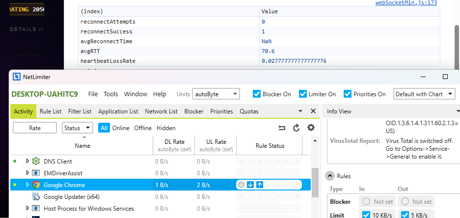

## WebSocket 弱网环境对战稳定性验证

本章节用于记录 **分布式高性能五子棋对战引擎**
在 **受限带宽与弱网络条件** 下的对战稳定性验证结果，
重点关注系统在 **网络延迟、带宽受限与轻度丢包** 场景中的
连接稳定性、心跳可靠性与状态一致性。

------

### 1. 测试背景与动机

在真实用户环境中，网络条件往往并非理想状态。
弱网场景（如移动网络、网络抖动、带宽受限）是
实时对战系统必须面对的常态。

相比高并发压测，弱网测试更关注：

- WebSocket 连接是否易被误判掉线
- 心跳机制在延迟与丢包下的鲁棒性
- 对战状态在网络波动下的正确性与可恢复性

------

### 2. 测试目标

本次弱网对战测试的目标包括：

- 验证弱网条件下 WebSocket 连接的稳定性
- 验证心跳机制是否会引发误判掉线
- 观察网络受限条件下的消息往返延迟（RTT）
- 验证完整对战流程在弱网环境下是否可顺利完成

------

### 3. 测试环境与网络条件

#### 3.1 服务端环境

| 项目       | 说明                   |
| ---------- | ---------------------- |
| 部署方式   | 云服务器 + Docker 容器 |
| 服务端框架 | Netty (NIO)            |
| 协议       | WebSocket + Protobuf   |
| 状态管理   | Redis / Redisson       |

#### 3.2 客户端网络限制（NetLimiter）

| 网络参数 | 配置值             |
| -------- | ------------------ |
| 上行带宽 | 5 KB/s             |
| 下行带宽 | 10 KB/s            |
| 网络延迟 | 轻度波动（非固定） |
| 丢包率   | 未强制注入         |

------

### 4. 测试模型设计

#### 4.1 测试流程

1. 客户端在弱网环境下建立 WebSocket 连接
2. 成功连接后进入对战流程
3. 客户端周期性发送心跳包
4. 服务端接收心跳并维持在线状态
5. 完成一场完整对战流程（匹配 → 对局 → 结束）

#### 4.2 设计说明

该测试模型刻意不引入并发建连压力，
以确保测试重点集中于 **弱网对战过程中的稳定性与体验表现**。

------

### 5. 测试结果汇总

| 指标               | 结果               |
| ------------------ | ------------------ |
| WebSocket 重连次数 | 0                  |
| 重连成功率         | 100%（未触发重连） |
| 平均心跳 RTT       | ~70 ms             |
| 心跳丢失率         | ~2.7%              |
| 对战完成情况       | 正常完成           |

效果截图：

现象观察：

- 对战过程中未发生 WebSocket 断连
- 页面跳转与状态同步阶段出现约 1 秒延迟
- 对战逻辑与状态未受网络限制影响

------

### 6. 性能分析与工程结论

#### 6.1 结果分析

- 在受限带宽条件下，心跳机制仍可稳定维持连接
- 心跳存在少量丢失，但未触发服务端掉线误判
- 对战流程在弱网环境下可完整执行

#### 6.2 工程判断

- 当前心跳 TTL 与判定窗口设计具备合理容错能力
- WebSocket 长连接对弱带宽环境具有良好适应性
- 服务端权威状态模型能够抵御网络波动带来的不确定性

#### 6.3 工程结论

- 系统在弱网环境下具备可用性与稳定性
- 网络受限不会引发连接风暴或状态错乱
- 当前实现满足真实用户弱网对战场景需求

------

### 7. 已知限制与后续计划

#### 已知限制

- 本次测试未引入强制断网或高丢包场景
- 当前测试为单对战流程，未叠加并发对战压力

#### 后续计划

- 注入短时断网进行重连验证
- 弱网 + 并发对战的组合测试