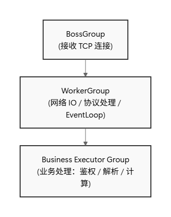

# Netty 线程模型说明

本文档用于说明 **本项目中 Netty 的线程模型设计、职责边界以及编码约束**。

目标是：
- 明确不同线程池的职责
- 避免在错误的线程中执行阻塞或高开销逻辑
- 为 WebSocket 高并发和稳定性提供基础约束

---

## 1. 总体线程模型概览

本项目使用 Netty 的 **多 EventLoopGroup + 业务线程池** 模型：



---

## 2. 各线程组职责说明

### 2.1 BossGroup（接收连接）

- 负责：
  - TCP accept
  - 建立 SocketChannel
- 特点：
  - 线程数固定为1
  - 不承载任何业务逻辑

> BossGroup不推荐也允许写任何业务代码

---

### 2.2 WorkerGroup（IO EventLoop）

WorkerGroup 中的线程是 **Netty IO 线程（EventLoop）**。

#### 负责内容：
- Socket 读写
- HTTP 解码 / 编码
- WebSocket 协议升级
- Frame 分发

---

### 2.3 业务线程池（Business Executor Group）

用于承载 **不能在 EventLoop 中执行的逻辑**。

本项目中主要用于：
- WebSocket 握手鉴权
- JWT 校验
- 业务级计算
- 事件发布

示例：

```java
EventExecutorGroup authExecutorGroup =
    new DefaultEventExecutorGroup(32);

pipeline.addLast(authExecutorGroup, new WebSocketAuthHandler());
```

#### 线程池设计原则：

- 在服务启动时创建（单例）
- 固定大小
- 与 CPU 核数相关（CPU × 2 ~ 4）

------

## 3. 本项目 Pipeline 与线程分布

### 3.1 WebSocket Pipeline 示例

```text
HttpServerCodec                    (WorkerGroup)
HttpObjectAggregator               (WorkerGroup)
WebSocketAuthHandler               (Business Executor)
WebSocketServerProtocolHandler     (WorkerGroup)
GameNettyHandler                   (WorkerGroup)
```

### 3.2 设计说明

- **协议层 Handler** → WorkerGroup
- **业务/鉴权 Handler** → 业务线程池
- 协议升级完成后，Pipeline 中只保留 WebSocket Frame 处理逻辑

## 4. 总结与约束原则

### 4.1 线程模型设计总结

本项目采用 **BossGroup + WorkerGroup + 业务线程池** 的 Netty 线程模型，其核心思想是：

> **IO 线程只做 IO，业务逻辑必须与 EventLoop 解耦。**

通过职责拆分，实现了以下目标：

- 避免 EventLoop 被阻塞，保证 IO 可预测性
- 支持 WebSocket 高并发建连与稳定运行
- 将高开销、不可控逻辑隔离到可调度的业务线程池中
- 提供清晰的编码边界，降低误用风险

------

### 4.2 EventLoop 使用硬性约束（必须遵守）

在 **WorkerGroup（EventLoop）线程中**：

允许：

- 协议解析（HTTP / WebSocket）
- Frame 分发
- 极轻量判断（字段检查、状态判断）
- Channel / Pipeline 管理（add / remove Handler）

严禁：

- 任何阻塞操作（`sleep` / `wait` / 锁等待）
- 数据库 / Redis / RPC 调用
- JWT 校验、加解密、序列化
- 同步日志（`System.out.println`、大量 `log.info`）
- 复杂业务计算
- 事件发布或跨模块调度

> **EventLoop 被阻塞 = 所有连接被阻塞**

------

### 4.3 业务线程池使用原则

业务线程池用于承载 **耗时、不可预测、可能阻塞的逻辑**，其设计目标是：

- 吞吐可控
- 延迟可隔离
- 失败可降级

使用规范：

- 必须在服务启动时创建（单例）
- 禁止在 Handler 内部动态创建
- 线程数与 CPU 核数成比例（通常为 `CPU × 2 ~ 4`）
- 仅用于业务逻辑，不承担 IO 职责

------

### 4.4 WebSocket 生命周期处理原则

WebSocket 连接在生命周期中，可能存在以下情况：

- 握手尚未完成即断开
- 鉴权失败主动关闭
- 客户端超时或主动断连

因此：

- `channelInactive` **不能假设用户一定已完成鉴权**
- 所有 Channel Attribute 必须进行空值判断
- 连接关闭属于**正常路径**，不应视为异常
- 写操作必须判断 Channel 是否仍然可用

> **异常路径放大 = 性能灾难**

------

### 4.5 性能与稳定性设计结论

- WebSocket 系统的核心指标是：
  - 可同时维持的连接数
  - 心跳与消息的稳定性
- 而不是：
  - 单位时间内的建连数量

在真实场景中：

- 建连是低频行为
- 长连接才是常态负载

因此，本线程模型更偏向 **长连接稳定性优化**，而非短连接爆发。

------

### 4.6 设计哲学

> **Netty 是事件驱动系统，而不是线程池系统。**
>
> 正确的设计不是“多开线程”，
>  而是**让每一类线程只做它该做的事**。

该线程模型作为项目的**基础约束**，后续功能扩展与性能优化应始终遵循本文档的原则。