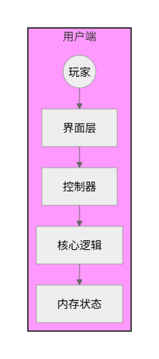
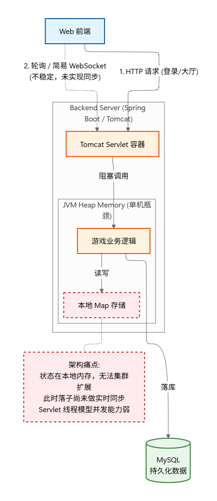

# 项目架构演进路径

本项目并非单纯的功能堆砌，而是随着对 **实时通信 ** **高并发 ** 认知的深入，经历了从**单机应用**到**分布式实时系统**的三次完整重构。

每一次演进，本质上都是对 **IO 模型、状态一致性与系统可用性** 的一次重新思考与取舍。

------

## 1: 单机逻辑原型 (MVP)

> **关键词**：MVC、Swing、面向对象设计、单机闭环

### 1.1 架构形态

最原始的验证性版本

采用标准的 Java Swing 开发，基于经典的 MVC (Model-View-Controller) 模式。此时系统是一个**富客户端（Rich Client）**应用，所有游戏逻辑、渲染、状态存储均在本地进程内存中完成。

### 1.2 核心设计

- **逻辑解耦**：初步实现了 UI 渲染与 游戏核心逻辑（Core Logic）的分离，为后续将逻辑迁移至后端奠定了基础。

- **复杂对象建模**：完成了“特殊棋子、技能冷却、胜负判定”的领域模型（Domain Model）设计。

  

### 1.3 架构瓶颈

- **孤岛效应**：单机模式无法满足多人在线对战的本质需求。
- **扩展性缺失**：客户端与逻辑强耦合，无法通过水平扩展来支持更多用户。

------

## 2: 基于 Servlet 的传统 Web 架构

> **关键词**：Spring Boot、BIO、HTTP 短轮询、WebSocket (Tomcat)

### 2.1 架构形态

将项目从桌面迁移至 Web。后端采用 **Spring Boot (Tomcat)**，利用 Servlet 容器提供的 WebSocket 能力实现初步联机。

### 2.2 技术实现

- **协议升级**：从本地方法调用转变为 **HTTP (Restful)** + **WebSocket** 网络通信。

- **前后端分离**：前端负责渲染，后端负责状态计算。

- **同步阻塞模型**：依赖 Servlet 线程池（Thread-per-connection）处理请求。

  

------

## 3: 基于 Netty 的分布式实时架构（当前版本）

> **关键词**：Netty (NIO)、Reactor 模型、Protobuf、Redis Pub/Sub、无状态化

### 3.1 重构动机

为了解决 Phase 2 中 线程模型效率低 与 单点状态瓶颈 的问题，对核心通信层进行了彻底重写。

目标从“实现功能”转向 “构建高吞吐、低延迟、可扩展的工业级后端”。

### 3.2 核心技术决策 (Key Engineering Decisions)

| **决策点**   | **Phase 2 (旧方案)** | **Phase 3 (新方案)**          | **决策理由**                                                 |
| ------------ | -------------------- | ----------------------------- | ------------------------------------------------------------ |
| **IO 模型**  | Servlet (阻塞/同步)  | **Netty (NIO / Reactor)**     | 利用 IO 多路复用，单线程处理成百上千连接，吞吐量提升显著。   |
| **通信协议** | JSON (文本)          | **Protobuf (二进制)**         | 消息体积压缩至 1/3，解析速度提升，降低网络带宽压力。         |
| **状态管理** | JVM 内存 (Map)       | **Redis (Redisson)**          | 将即时对战状态下沉至中间件，实现服务**无状态化**，支持集群部署。 |
| **并发控制** | `synchronized`       | **Redis 分布式锁 / 原子操作** | 解决多用户并发落子导致的状态不一致问题。                     |

### 3.3 业务与工程的深度结合

在 当前阶段中，引入了更复杂的业务场景（技能冷却、全局状态影响），其目的不仅是增加游戏性，更是为了**倒逼架构升级**：

- **复杂性测试**：利用复杂的技能结算逻辑，验证 Netty 业务线程池（Business Group）与 IO 线程组（Boss/Worker Group）的**隔离设计**是否有效，防止业务阻塞网络 IO。
- **稳定性验证**：通过 JMeter 压测（500+ 并发），验证了连接握手、心跳保活与异常断连机制的健壮性。

------

## 演进总结 

本项目记录了本人从 **“CRUD 思维”** 向 **“分布式系统思维”** 的跨越：

1. **从“能连上就行”到“关注连接生命周期”**：深刻理解了 TCP 拆包粘包、心跳检测、断线重连等网络编程细节。
2. **从“本地内存”到“分布式状态”**：掌握了如何在无状态服务中维护强一致性的游戏逻辑。
3. **从“由于报错修 Bug”到“基于压测做优化”**：建立了以数据和监控为导向的性能优化方法论。

**现在**，系统已具备在云环境下稳定运行的能力。